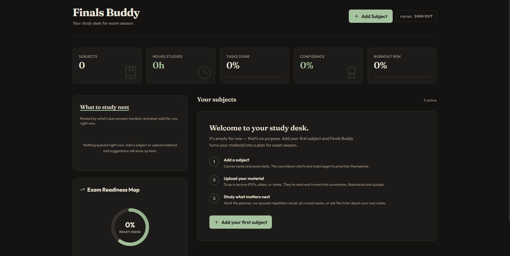

# 🎓 Finals Buddy

**An AI-powered study companion that turns your lecture slides, PDFs, and notes into an adaptive finals-prep workspace — flashcards, quizzes, mock exams, a RAG tutor, and a smart study planner, all generated from your own course material.**

<p align="center">
  
  
  
  
  
  
  
  
</p>

<!-- 🔗 Add your live URLs once deployed:
<p align="center">
  <a href="https://your-frontend.vercel.app"><b>🚀 Live Demo</b></a> &nbsp;·&nbsp;
  <a href="https://finalsbuddy.duckdns.org/docs"><b>📖 API Docs</b></a>
</p>
-->

---

## ✨ What it does

Upload your course material and Finals Buddy does the rest — parsing the documents, mapping out the key topics, and building a full active-recall study system around them. Every study aid is grounded in **your** slides, not generic content.

| Feature | Description |
|---|---|
| 📥 **Material ingestion** | Upload `PDF`, `DOCX`, `PPTX`, or `TXT`. Files are parsed, chunked, embedded into a vector store, and turned into a structured **knowledge map** of topics and difficulty. |
| 🃏 **Auto-generated flashcards** | Leitner-box **spaced repetition** (1 → 2 → 3 → 4 → 5-day intervals) built automatically from your material. |
| ❓ **Active-recall quizzes** | Multiple-choice quizzes generated per topic, with instant grading and explanations. |
| 📝 **Mock exams** | Full timed practice exams generated from your material, auto-graded on submission. |
| 🤖 **RAG tutor** | Chat with your own material. Switch tutor personas — *Standard*, *Explain like I'm 5*, or *Analogies* — for the explanation style that clicks. |
| 🧮 **Formula sheets** | Auto-extracted, KaTeX-rendered formula reference sheets with per-formula notes. |
| 📓 **Rich notes** | A Notion-style block editor (TipTap) with Markdown, math, images, and file embeds. |
| ✅ **Smart study planner** | Task checklist whose priorities re-rank themselves as exam dates approach. |
| 🎯 **Recommendation engine** | Surfaces the single highest-ROI thing to do next via a weighted priority score (see below). |
| ⏱️ **Focus mode** | Distraction-free full-screen canvas with a built-in Pomodoro timer. |
| 🔐 **Auth + admin** | JWT authentication and a lightweight admin dashboard (usage stats, logs, health checks, live API-key rotation). |

### The recommendation score

The dashboard ranks every pending task with a weighted priority formula:

```
Score = (Exam Urgency × 0.4) + (Topic Importance × 0.3) + ((100 − Confidence) × 0.2) + (Incompletion × 0.1)
```

So the thing you're least confident about, on the subject with the nearest exam, always floats to the top.

---

## 🖼️ Screenshots

<!-- Drop your screenshots in a docs/ folder and reference them here for the LinkedIn post:
| Dashboard | Subject portal | RAG tutor |
|---|---|---|
|  |  |  |
-->

> _Add a couple of screenshots here — they make the biggest difference on a project showcase._

---

## 🛠️ Tech Stack

**Frontend**
- **Next.js 16** (App Router, Turbopack) + **React 19** + **TypeScript**
- **Tailwind CSS v4** — fully responsive, mobile-first
- **TipTap** rich-text editor · **KaTeX** math rendering · **lucide-react** icons

**Backend**
- **FastAPI** + **SQLAlchemy 2** + **SQLite** + **Pydantic v2**
- **LangChain** + **LangGraph** agent orchestration over **Groq** (Llama) models
- Document parsing via **pypdf**, **docx2txt**, **python-pptx**
- A lightweight NumPy vector store for RAG retrieval
- **headroom-ai** context compression to cut token spend on large chunks
- **JWT** auth

**Infrastructure**
- **Docker** on an Oracle Cloud Always-Free **ARM** VM, with **Caddy** for automatic HTTPS
- **Frontend on Vercel**
- **GitHub Actions CI/CD** — every push to `master` that touches the backend auto-rebuilds and redeploys the container over SSH, no manual steps

---

## 🚀 Getting Started

**Requirements:** Node.js 18+ and Python 3.11+.
AI features need a free [Groq API key](https://console.groq.com/keys). Without one, CRUD/auth still work fully and AI-generation endpoints return a clear `503` (no fake data).

### 1. Backend

```bash
cd backend
python -m venv venv
# Windows: .\venv\Scripts\Activate.ps1   |   macOS/Linux: source venv/bin/activate
pip install -r requirements.txt

cp .env.example .env        # then add your GROQ_API_KEY
python -m uvicorn app.main:app --reload --port 8000
```

API + interactive Swagger docs → **http://localhost:8000/docs**

### 2. Frontend

```bash
cd frontend
npm install
npm run dev
```

App → **http://localhost:3000**

> If the frontend and backend run on different hosts, set `NEXT_PUBLIC_API_URL` for the frontend (e.g. `http://localhost:8000/api`).

---

## 📂 Project Structure

```
finals-buddy/
├── backend/                      # FastAPI + SQLAlchemy + SQLite
│   ├── app/
│   │   ├── main.py               # API endpoints (auth, subjects, materials, quizzes, …)
│   │   ├── admin.py              # Admin dashboard API (stats, logs, key rotation)
│   │   ├── auth.py               # JWT authentication
│   │   ├── config.py             # Env config + runtime key overrides
│   │   ├── models.py             # SQLAlchemy tables
│   │   ├── schemas.py            # Pydantic schemas
│   │   └── services/
│   │       ├── langchain_chat.py # LangChain/LangGraph tutor + generation
│   │       ├── agents.py         # Agent orchestration
│   │       └── vector_store.py   # RAG embeddings + retrieval
│   └── Dockerfile
├── frontend/                     # Next.js 16 App Router
│   └── src/
│       ├── app/
│       │   ├── page.tsx          # Global dashboard
│       │   ├── subject/[id]/     # Interactive subject portal (notes, quizzes, tutor…)
│       │   ├── admin/            # Admin dashboard UI
│       │   └── login/
│       ├── components/           # NotionEditor, Toast, …
│       └── lib/api.ts            # API client
├── .github/workflows/            # CI/CD auto-deploy
├── DEPLOY.md                     # Full $0/month deployment walkthrough
└── README.md
```

---

## ☁️ Deployment

The whole stack runs on free tiers — **[`DEPLOY.md`](DEPLOY.md)** is a step-by-step, first-timer walkthrough: Oracle Cloud Always-Free ARM VM for the backend (Docker + Caddy + persistent volume), Vercel for the frontend, and a GitHub Actions workflow that auto-redeploys the backend on every push.

---

## 📜 License

Released under the MIT License. _(Add a `LICENSE` file if you'd like it to render on the GitHub sidebar.)_

---

<p align="center"><i>Built to make finals week a little less painful.</i></p>
